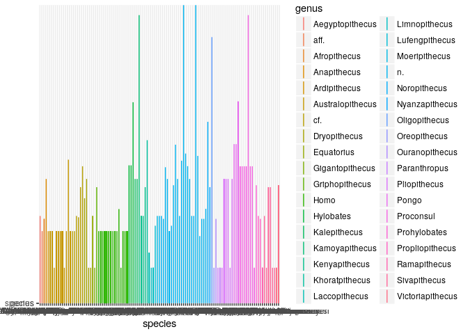
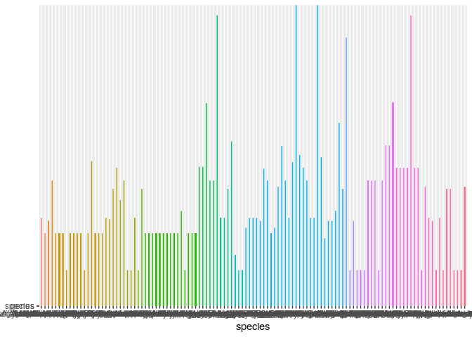
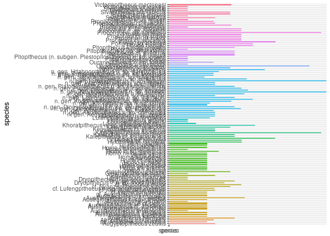
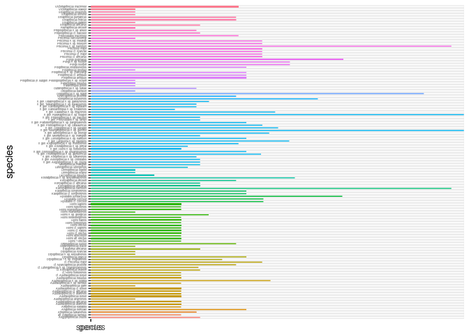
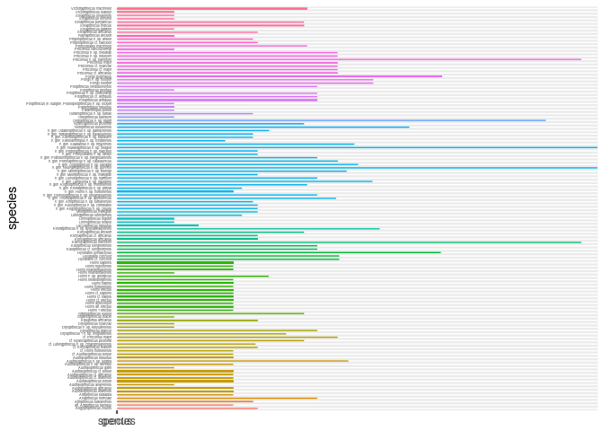

    library(ggplot2) 

    catarr <- read.csv("~/Desktop/eeb-177/Homework/catarrhinioutput.csv", header = F, as.is = T) 
    names(catarr) <- c("genus", "species", "minage", "maxage")
    head(catarr)

    ##            genus                    species minage  maxage
    ## 1 Lufengpithecus Lufengpithecus lufengensis  89270   genus
    ## 2  Laccopithecus     Laccopithecus robustus  58366 species
    ## 3   Sivapithecus       Sivapithecus indicus 133676 species
    ## 4          Pongo             Pongo pygmaeus 232338 species
    ## 5           Homo               Homo sapiens  83088 species
    ## 6           Homo               Homo sapiens  83088 species

    catarr_occ <- ggplot(catarr, aes( species, ymin = maxage, ymax=minage, colour = genus))
    catarr_occ <- catarr_occ + geom_linerange()
    catarr_occ

    catarr_occ <- catarr_occ + theme(legend.position="none")
    catarr_occ

    catarr_occ <- catarr_occ + coord_flip()
    catarr_occ

    catarr_occ <- catarr_occ + theme(legend.position="none")
    catarr_occ

    catarr_occ <- catarr_occ +  theme(axis.text.y = element_text(size=3))
    catarr_occ

    catarr_occ <- catarr_occ + theme(axis.ticks.y=element_blank())
    catarr_occ

    catarr_occ <- catarr_occ + scale_y_continuous(limits=c(0, 30), expand = c(0, 0), breaks=c(0, 10, 20, 30, 40))

    catarr_occ <- catarr_occ + labs(title = "Catarrhini Fossil Occurrences", x = "Species", y = "Ma ago") + theme(plot.title = element_text(hjust = 0.5, size=22, face = "bold"), axis.title =element_text(size=20))
