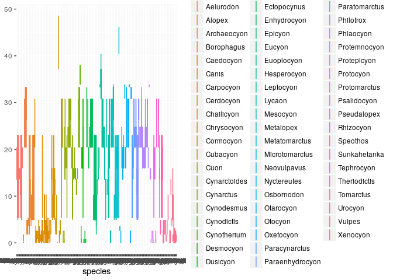
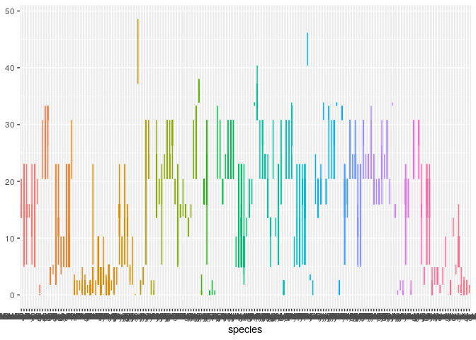
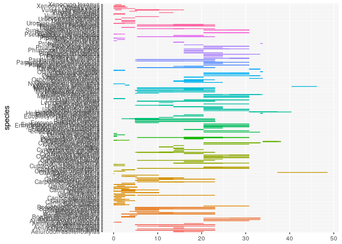
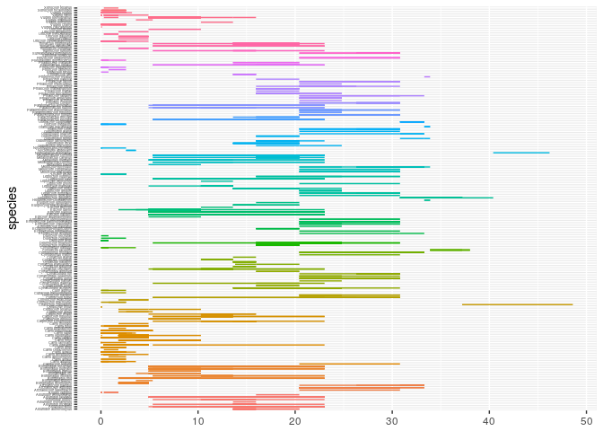
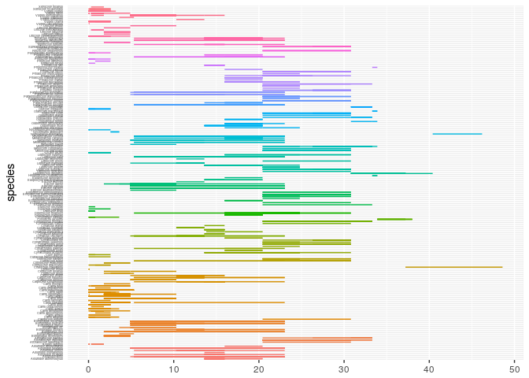
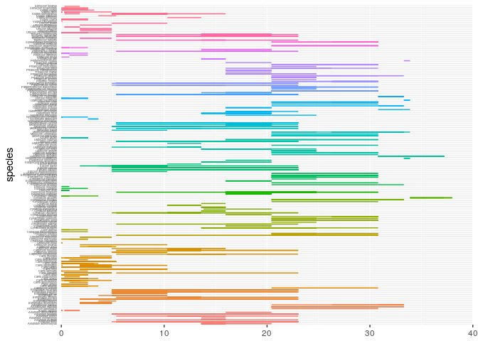
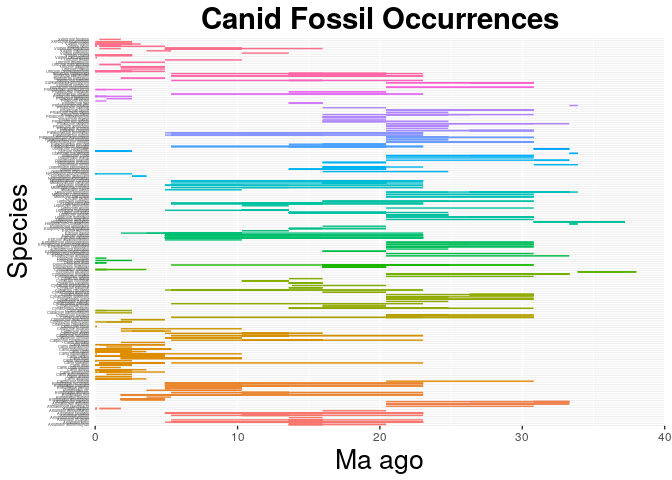

    library(ggplot2)

    canids <- read.csv("~/Desktop/eeb-177/Homework/canidsoutput.csv", header = F, as.is = T)
    names(canids) <- c("genus", "species", "minage", "maxage")
    head(canids)

    ##         genus               species minage maxage
    ## 1  Cynodictis  Cynodictis lacustris   33.9   37.2
    ## 2 Neovulpavus Neovulpavus washakius   40.4   46.2
    ## 3 Hesperocyon Hesperocyon gregarius   37.2   40.4
    ## 4 Hesperocyon Hesperocyon gregarius   33.9   37.2
    ## 5 Hesperocyon Hesperocyon gregarius   33.9   37.2
    ## 6 Hesperocyon Hesperocyon gregarius   33.9   37.2

    canid_occ <- ggplot(canids, aes( species, ymin = maxage, ymax=minage, colour = genus))
    canid_occ <- canid_occ + geom_linerange()
    canid_occ

    canid_occ <- canid_occ + theme(legend.position="none")
    canid_occ

    canid_occ <- canid_occ + coord_flip()
    canid_occ

    canid_occ <- canid_occ +  theme(axis.text.y = element_text(size=3))
    canid_occ

    canid_occ <- canid_occ + theme(axis.ticks.y=element_blank())
    canid_occ

    canid_occ <- canid_occ + scale_y_continuous(limits=c(0, 40), expand = c(0, 0), breaks=c(0, 10, 20, 30, 40))
    canid_occ

    ## Warning: Removed 3 rows containing missing values (geom_linerange).

    canid_occ <- canid_occ + labs(title = "Canid Fossil Occurrences", x = "Species", y = "Ma ago") + theme(plot.title = element_text(hjust = 0.5, size=22, face = "bold"), axis.title =element_text(size=20))
    canid_occ

    ## Warning: Removed 3 rows containing missing values (geom_linerange).

